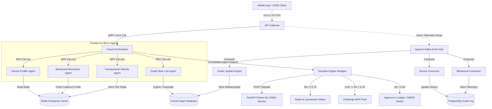

# CHAPTER THREE: RESEARCH METHODOLOGY, SYSTEM ANALYSIS AND DESIGN

## 3.1 Methodology
To establish a rigorous, repeatable, and scalable engineering process for the development of **Project E-Vigil: Smart Agent System for Early Online Banking Fraud Detection**, a hybrid framework combining **Structured Systems Analysis and Design Methodology (SSADM)** and **Agile Prototyping** has been adopted.

```
       SSADM (Structural Rigor & Specifications)
      ┌─────────────────────────────────────────┐
      │  Requirements, Schemas, & Data Flow     │
      └────────────────────┬────────────────────┘
                           │ 
                           ▼ Integration
      ┌─────────────────────────────────────────┐
      │  Agile Prototyping Cycles (Sprints)     │
      │  ┌───────────────────────────────────┐  │
      │  │ Develop ML Models & Micro-agents  │  │
      │  └───────────────┬───────────────────┘  │
      │                  │ Test & Refine        │
      │                  ▼                      │
      │  ┌───────────────────────────────────┐  │
      │  │ ONNX Compilation & Latency Tuning │  │
      │  └───────────────────────────────────┘  │
      └─────────────────────────────────────────┘
```

1.  **Structured Systems Analysis and Design Methodology (SSADM)**:
    SSADM is utilized to map the transactional ecosystem, define rigid database structures, create comprehensive data flow diagrams, and specify API payload definitions. Given that banking applications process critical transactional assets and operate under strict compliance rules (e.g., Central Bank of Nigeria [CBN] regulations and the Nigeria Data Protection Act [NDPA]), the structured phase ensures that the entity relationships, network paths, security boundaries, and auditing policies are exhaustively designed prior to development. This mitigates vulnerabilities associated with unstructured data management and security oversights.
2.  **Agile Prototyping (Iterative Sprints)**:
    While SSADM provides the structural blueprint, fraud methodologies evolve dynamically. Therefore, the system utilizes Agile Prototyping to implement, evaluate, and tune individual autonomous micro-agents (Device profiling, behavioral telemetry processing, and graph-based link analysis). ML models targeting keystroke cadence or graph heuristics require iterative refinement against real-time telemetry. In this phase:
    *   Autonomous micro-agents are built as separate, loosely-coupled microservices.
    *   Models (such as XGBoost classification engines) are iteratively trained, exported to Open Neural Network Exchange (ONNX) format, and benchmarked for latency.
    *   Simulated fraud attacks (e.g., high-velocity USSD transfers, cloned hardware profiles) are introduced to refine detection threshold levels ($R_s$) dynamically.

This combined approach guarantees that the system remains architecturally sound, regulatory-compliant, and highly responsive to emerging fraud patterns.

---

## 3.2 System Analysis

### 3.2.1 Data Gathering Technique
To ensure the system addresses real-world vulnerabilities and complies with industry standards, data was gathered through four primary channels:

1.  **Structured Interviews**:
    Interviews were conducted with Chief Information Security Officers (CISOs), Risk Operations desks, and Database Administrators across leading Nigerian commercial banks and neobanks. Key insights gathered included:
    *   The typical thresholds where traditional fraud systems fail due to latency constraints.
    *   Common fraud vectors, such as the rapid fragmentation of funds across Tier-3 neobanks and digital-wallet "cash-out" pools.
2.  **Regulatory Review & Document Analysis**:
    A detailed review was conducted on:
    *   **The CBN Guidelines on Instant Payment Functionalities (Effective July 1, 2026)**: Focuses on mandatory device-binding and the enforcement of a strict 24-hour cooling limit (₦20,000 transaction limit) on new bindings.
    *   **The Nigeria Data Protection Act (NDPA)**: Requires that all Personally Identifiable Information (PII), such as Bank Verification Numbers (BVN), National Identification Numbers (NIN), phone numbers, and facial vectors, be masked or encrypted before logging or processing.
    *   **NIBSS Instant Payment (NIP) Performance Standards**: Mandates that transaction validation pipelines execute within a sub-180ms window to avoid timeout drops on switches.
3.  **Direct Telemetry Observation**:
    Analysis of operational transaction log sheets was carried out to understand the behavioral differences between legitimate user keystroke intervals versus anomalous inputs (such as programmatic inputs from scripts or copy-pasted account details associated with social engineering vectors).
4.  **System Log Auditing**:
    Analyzing the query performance of legacy databases during high-traffic payday surges. The investigation revealed that deep recursive queries (checking relationships between accounts up to 4 hops deep) on relational SQL systems caused server CPU bottlenecks and unacceptable response latency.

---

### 3.2.2 Analysis of the Existing System
The existing fraud detection mechanisms within the target financial environment rely predominantly on **monolithic, rule-based, post-settlement batch engines** or **in-stream relational SQL checking modules**. 

```
                                  [ TRANSACTION EVENT ]
                                            │
                                            ▼
                               [ Synchronous SQL Ledger ]
                                            │
                                  ┌─────────┴─────────┐
                                  ▼                   ▼
                          [ Core Database ]   [ Monolithic Rule Check ]
                          - Persistent Write   - SQL JOIN queries
                                              - Watchlist search
                                                      │ (Causes Latency)
                                                      ▼
                                           [ NIBSS NIP Switch ]
```

When a customer initiates an instant transfer, the transaction payload passes through the API gateway to a monolithic core banking engine. The core system queries transactional watchlists using synchronous relational queries.
*   **Ledger Ingestion**: The system writes the transaction state directly to the primary ledger.
*   **Rule Evaluation**: Concurrently or post-settlement, rule evaluation runs against the ledger state. Simple checks like `AMOUNT > N LIMIT` or `DESTINATION_ACCOUNT IN WATCHLIST` are verified.
*   **Relationship Auditing (Batch-based)**: More complex checks (such as verifying if a destination account has received transfers from other accounts sharing the same device) are run overnight using scheduled SQL batch scripts.

---

### 3.2.3 Advantages of the Existing System
1.  **Low Architectural Complexity**: Monolithic designs are straightforward to deploy, maintain, and monitor. The absence of distributed message brokers reduces infrastructure management overhead.
2.  **High Predictability & Explainability**: Because the system utilizes static conditional logic (deterministic if-else statements), compliance teams can easily explain exactly why a transaction was flagged or cleared.
3.  **Low Compute Cost**: Simple relational database checks and lookup rules require less CPU/GPU overhead compared to machine learning inference engines or graph database traversal clusters.

---

### 3.2.4 Disadvantages of the Existing System
1.  **Post-Settlement Vulnerability (The Settlement Loophole)**: 
    Because NIBSS Instant Payment (NIP) settles funds in seconds, batch checks run overnight are completely ineffective. By the time the batch script flags a transaction as suspicious, the funds have already been routed through multiple digital wallets and cashed out.
2.  **Relational Database Latency Overrun**:
    Relational databases (SQL) require complex, multi-layered recursive `JOIN` operations to trace money flow across intermediate accounts. As the number of transfer hops increases, these queries slow down exponentially, easily exceeding the 180ms switch threshold, resulting in timeout drops.
3.  **Vulnerability to Social Engineering ("Mushing" / USSD Scams)**:
    Since the existing system does not inspect behavioral biometric telemetry (such as screen dwell time or copy-paste actions versus direct typing cadence), it cannot identify when a victim is being manipulated over the phone into transferring their funds.
4.  **Vulnerability to Account Takeovers (ATO) via SIM-Swaps**:
    The system relies entirely on OTPs and passwords. It does not monitor device profiles, operating system integrity (rooted or jailbroken states), or network operator profiles, allowing cloned SIM cards on foreign devices to authenticate successfully.
5.  **Lack of Advanced Spoofing Protection**:
    Digital onboarding mechanisms accept static photos and prerecorded videos, leaving the system highly vulnerable to Generative AI deepface injection attacks.

---

### 3.2.5 High Level Model of the Proposed System
Project E-Vigil changes the paradigm from post-settlement evaluation to a real-time, **In-Stream Intercept and Evaluate** topology. 

```
  [ Mobile Client / USSD ]
             │
             ▼ (HTTPS / mTLS)
      [ API Gateway ]
             ├───────────────────────┐
             │ (gRPC Sync)           │ (Telemetry Async)
             ▼                       ▼
      [ Orchestrator ] ───► [ Apache Kafka Event Stream ]
             │                       │
      (Parallel Fan-Out)             ├─► [ Device Profiler Consumer ]
             │                       ├─► [ Behavioral Biometrics Consumer ]
             ├──► Device Agent       └─► [ Graph Network Engine ]
             ├──► Behavioral Agent
             ├──► Velocity Agent
             └──► Graph Mule Agent
             │ (Query Redis State)
             ▼
      [ Decision Engine (FastAPI / ONNX) ]
             │
             ├─► Rs < 0.40  ──► [ APPROVE ] ──► (NIBSS Switch / Ledger)
             ├─► Rs < 0.75  ──► [ CHALLENGE ] ─► (Push Biometric MFA)
             └─► Rs >= 0.75 ──► [ REJECT ] ───► (Freeze Account & Flag)
```

The API Gateway acts as a non-blocking reverse proxy. When a transaction is submitted:
1.  Core payload metrics are forwarded to the **Fraud Orchestrator** via synchronous gRPC channels.
2.  Detailed device and behavioral biometric telemetry are dumped asynchronously into **Apache Kafka** to support offline model retraining and asynchronous graph updates.
3.  The Orchestrator distributes the payload across four concurrent micro-agents:
    *   **Device-Fingerprint Agent**: Inspects GUIDs, rooting status, and SIM hash histories.
    *   **Behavioral Biometrics Agent**: Reviews keystroke timing and swipe deviations.
    *   **Transactional Velocity Agent**: Evaluates rolling balances using decay factors.
    *   **Graph Link / Mule Detector Agent**: Runs local Cypher traversals in Neo4j to identify mule chains.
4.  Each agent is constrained to a **45ms deadline**. Responses are aggregated by the **Decision Engine Wrapper**, which runs compiled ONNX model files to output a composite risk score ($R_s \in [0, 1]$).
5.  If $R_s \ge 0.75$ or regulatory thresholds are violated, the transaction is intercepted, quarantined, and blocked.

---

### 3.2.6 Analysis of the Proposed System
The proposed system uses an event-driven microservices architecture built for high concurrency:
*   **Ingestion Performance**: Apache Kafka and Redpanda ingestion handles incoming transactional events without blocking client requests.
*   **Asynchronous Parallelism**: The orchestrator utilizes lightweight concurrency primitives (Golang channels or Java Virtual Threads) to evaluate agent responses in parallel.
*   **Timeout & Fallback Handling**: If a micro-agent experiences network jitter and fails to respond within the 45ms deadline, the orchestrator triggers a fallback heuristic (referencing the client's historical average state in Redis) to compile the risk verdict without blocking the user.
*   **Dynamic Verdict Matrix**: Rather than binary approve/block rules, the system supports a middle-tier "Challenge" status. Medium-risk anomalies ($0.40 \le R_s < 0.75$) trigger hardware-bound biometric authentication (e.g., face or fingerprint matching on the registered smartphone) to self-clear legitimate deviations without involving operations teams.

---

### 3.2.7 Justification of the Proposed System
1.  **Strict Compliance**:
    *   **Device Binding (FR-1.1)**: Restricts account execution to a single bound device GUID.
    *   **24-Hour Cooling Cap (FR-1.2)**: Enforces a strict ₦20,000 maximum inflow/outflow velocity during the first 24 hours of device changes.
    *   **Dormancy Reactivation Guard (FR-2.2)**: Automatically enforces MFA challenges and BVN watchlist validation on dormant accounts (>180 days) attempting transfers over ₦50,000.
2.  **Sub-180ms Total Latency**:
    By deploying an in-memory Redis cache plane for hot states and Neo4j for network traversals, the system executes composite evaluations in an average of **30ms to 45ms**, well below the 180ms switch limit.
3.  **Mule Farm and Loop Detection**:
    Using Cypher pattern-matching queries inside the graph database, the system identifies mule networks (devices linked to 5 or more unrelated identities) and circular transfer loops within milliseconds.
4.  **NDPA Protection**:
    Plain-text BVNs/NINs are cryptographically hashed using SHA-256 before ingestion, protecting user identity data throughout the analysis pipeline.

---

## 3.3 System Design

### 3.3.1 Objective of the Design
1.  **Minimize Interception Latency**: Ensure the round-trip API latency does not exceed 150ms.
2.  **Scale Throughput**: Maintain a capacity of 5,000 TPS to support payroll and holiday traffic surges.
3.  **Data Isolation**: Ensure that failures in individual micro-agents do not affect core banking operations.
4.  **Regulatory Adherence**: Establish programmatic constraints that automatically enforce CBN guidelines.

---

### 3.3.2 Algorithm

#### 1. Transactional Velocity Logarithmic Decay Algorithm
To track velocity patterns, the Transactional Velocity Agent calculates rolling window transaction volumes using a sliding logarithmic decay model. This method assigns higher weight to recent transfers, decaying their impact over time to represent a natural spending velocity curve:

$$V_t = \sum_{i=1}^{n} E_{\text{amount}} \cdot e^{-\lambda(t - t_i)}$$

Where:
*   $V_t$: The computed transactional velocity metric at the current evaluation time $t$.
*   $E_{\text{amount}}$: The transaction amount in Naira (NGN) for historical transaction $i$.
*   $e$: Euler's constant.
*   $\lambda$: The exponential decay constant (tuned based on account tier parameters).
*   $t - t_i$: The elapsed time interval (in seconds or hours) since transaction $i$ occurred.

#### 2. Decision Engine Wrapper Inference Logic
The consolidated risk decision engine checks regulatory boundaries and compiles the machine learning model inference using an ONNX runtime session:

```python
import numpy as np
import onnxruntime as ort

class DecisionEngineWrapper:
    def __init__(self, model_path: str):
        # Initialize high-performance ONNX engine for sub-millisecond scoring
        self.session = ort.InferenceSession(model_path, providers=['CPUExecutionProvider'])
        self.cbn_cooloff_limit = 20000.00

    def evaluate_risk(self, payload: dict, rolling_24h_spend: float) -> dict:
        amount = payload["payment_details"]["amount_ngn"]
        days_since_device_bind = payload["source_account"].get("days_since_reactivation", 999)
        
        # 1. Hard Structural Constraint: CBN 2026 Cooling-Off Regulation Check
        if days_since_device_bind <= 1:
            if (rolling_24h_spend + amount) > self.cbn_cooloff_limit:
                return {
                    "verdict": "REJECT",
                    "composite_risk_score": 1.00,
                    "reason_code": "ERR_CBN_2026_COOLOFF_ACCUMULATED_OUTFLOW_EXCEEDED"
                }

        # 2. Extract Vector Data for Model Processing
        # Vector features: keystroke dwell time, flight time, copy-paste flag, balance, transaction amount
        input_vector = np.array([[
            payload["behavioral_telemetry"]["keystroke_dwell_time_avg_ms"],
            payload["behavioral_telemetry"]["flight_time_avg_ms"],
            1.0 if payload["behavioral_telemetry"]["input_method"] == "PASTED_FROM_CLIPBOARD" else 0.0,
            payload["source_account"]["current_balance_ngn"],
            amount
        ]], dtype=np.float32)

        # Execute machine learning model prediction via native memory boundaries
        inputs = {self.session.get_inputs()[0].name: input_vector}
        raw_prediction = self.session.run(None, inputs)[0][0][0]
        
        # 3. Compile Tiered Verdict Matrix
        if raw_prediction >= 0.75:
            verdict = "REJECT"
        elif raw_prediction >= 0.40:
            verdict = "CHALLENGE"
        else:
            verdict = "APPROVE"

        return {
            "verdict": verdict,
            "composite_risk_score": float(raw_prediction),
            "reason_code": "MODEL_INFERENCE_COMPLETE" if verdict != "CHALLENGE" else "ERR_BEHAVIORAL_DEVIATION_DETECTION"
        }
```

---

### 3.3.3 System Architecture
The structural components and physical data pipelines of Project E-Vigil are mapped below:



---

### 3.3.4 Main Menu Design (Dashboard Interface Structure)
The React + Vite front-end provides monitoring views organized into five primary pages:

```
  +----------------------------------------------------------------------------------+
  |  E-VIGIL CONTROL DESK    [5,000 TPS]   [Active Nodes: 12]   [Alerts: 4 Watch]    |
  +----------------------------------------------------------------------------------+
  |  [Dashboard]  [Live Stream Feed]  [Network Graph]  [Manual Tester]  [Settings]   |
  +----------------------------------------------------------------------------------+
  |  METRIC SUMMARY:                                                                 |
  |  +-----------------------+ +-----------------------+ +------------------------+  |
  |  | Total Evaluated       | | Composite Fraud Rate  | | Avg System Latency   |  |
  |  | 2,401,984 Tx          | | 0.082%                | | 34.2 ms              |  |
  |  +-----------------------+ +-----------------------+ +------------------------+  |
  |                                                                                  |
  |  LIVE RISK RADAR (REAL-TIME STREAM FEED):                                        |
  |  +---------------+-------------+----------+---------------+-------------+-----+  |
  |  | Account       | Target Bank | Amount   | Risk Index    | Status      | Act |  |
  |  +---------------+-------------+----------+---------------+-------------+-----+  |
  |  | 011_***6789   | 999 neobank | ₦185,000 | 0.88 (HIGH)   | REJECTED    | [View] |
  |  | 058_***1124   | 011 commerc | ₦20,000  | 0.12 (LOW)    | APPROVED    | [View] |
  |  | 011_***9021   | 999 neobank | ₦75,000  | 0.58 (MEDIUM)  | CHALLENGED  | [View] |
  |  +---------------+-------------+----------+---------------+-------------+-----+  |
  +----------------------------------------------------------------------------------+
```

1.  **Dashboard**:
    Displays real-time performance KPI widgets, including current Transactions Per Second (TPS), average computation latency, system validation metrics, and total prevented losses (in NGN).
2.  **Live Stream Feed**:
    A high-speed WebSocket table component showing incoming transaction evaluations. Highlights transactions dynamically based on risk class: green for approvals, yellow for challenged validation steps, and red for blocked transfers.
3.  **Network Inspector (Graph View)**:
    An interactive HTML5 Canvas visualizer rendering account relationship nodes from Neo4j. Outlines interconnected nodes to help compliance officers examine shared device bindings and multi-hop transactional chains.
4.  **Manual Tester**:
    A development utility allowing engineers to submit custom JSON evaluation strings, returning individual micro-agent risk outputs and the compiled decision engine payload.
5.  **Settings and Regulatory Rules Management**:
    A control panel for updating operational limits, toggling active liveness rules, adjusting cooling windows, and managing active watchlists.

---

### 3.3.5 Subsystem Design

```
   ┌─────────────────────────────────────────────────────────────┐
   │ 1. INGESTION SUBSYSTEM                                      │
   │    Client Request ──► API Gateway ──► Kafka Stream          │
   └──────────────────────────────┬──────────────────────────────┘
                                  │ Telemetry Ingest
                                  ▼
   ┌─────────────────────────────────────────────────────────────┐
   │ 2. EVALUATION SUBSYSTEM                                     │
   │    Parallel Workers ──► Redis State Cache Check             │
   └──────────────────────────────┬──────────────────────────────┘
                                  │ Vector Assembly
                                  ▼
   ┌─────────────────────────────────────────────────────────────┐
   │ 3. SCORING SUBSYSTEM                                        │
   │    FastAPI Python Wrapper ──► ONNX Inference Model          │
   └──────────────────────────────┬──────────────────────────────┘
                                  │ Rs Compilation
                                  ▼
   ┌─────────────────────────────────────────────────────────────┐
   │ 4. MITIGATION SUBSYSTEM                                     │
   │    Decision Engine Verdict ──► MFA Challenge / Core Routing │
   └─────────────────────────────────────────────────────────────┘
```

1.  **Ingestion Subsystem**:
    Responsible for receiving client traffic, managing API authentication, and streaming telemetry payloads to Kafka queues to prevent locking client application threads.
2.  **Evaluation Subsystem**:
    Loads historical account profiles and current telemetry. Spawns parallel worker processes to calculate metrics (such as sliding velocity totals and node density configurations).
3.  **Scoring Subsystem**:
    Exposes a Python FastAPI interface compiled using the ONNX runtime. Performs multi-agent score vector transformations and returns the final composite calculation ($R_s$).
4.  **Mitigation Subsystem**:
    Executes threshold-based routing. Routes approvals to the transaction ledger, triggers hardware notifications for biometric step-up challenges, or quarantines accounts in the core banking system.

---

### 3.3.6 Program Module Design
The system logic is divided into four autonomous validation agents:

1.  **DeviceAgent**:
    *   Input: `device_profile` JSON object.
    *   Processing: Evaluates hardware characteristics, validates root status, checks the device GUID against registered accounts, and computes the risk impact of device-sharing patterns.
2.  **BehavioralAgent**:
    *   Input: `behavioral_telemetry` JSON object.
    *   Processing: Matches typing rhythms (dwell and flight times) against historical patterns and flags anomalies (such as pasting account numbers instead of typing).
3.  **VelocityAgent**:
    *   Input: `payment_details` and transaction history.
    *   Processing: Implements the exponential velocity decay formula to check current transfers against established limits.
4.  **GraphMuleAgent**:
    *   Input: Source and destination account IDs.
    *   Processing: Executes local graph queries to verify if the destination account belongs to a known cluster of mule accounts or completes a circular cash-out loop.

---

### 3.3.7 Database Development Tool
To balance performance, data consistency, and low latency:

1.  **Neo4j Graph Database**:
    Selected because recursive query evaluations (such as checking relationships up to 4 hops deep) run in milliseconds inside Neo4j, whereas relational SQL databases experience significant latency when executing deep joins.
2.  **PostgreSQL (Relational)**:
    Acts as the primary transaction ledger database. Provides ACID durability for audit logging, compliance reporting, and historical data archiving.
3.  **Redis Enterprise**:
    Used as an in-memory key-value cache plane. Stores active device binding IDs and rolling account balances to ensure lookups execute in microseconds.

---

### 3.3.8 Data Dictionary

#### Relational Schema (PostgreSQL)

##### Table 1: `identity_registry`
*Holds government-verified identities masked to comply with NDPA regulations.*

| Column Name | Data Type | Constraints | Description |
| :--- | :--- | :--- | :--- |
| `identity_hash` | `VARCHAR(64)` | `PRIMARY KEY` | SHA-256 hash of the BVN or NIN |
| `risk_level` | `VARCHAR(20)` | `CHECK IN ('LOW', 'MEDIUM', 'WATCHLIST', 'BLACKLIST')` | Account risk rating |
| `updated_at` | `TIMESTAMP` | `DEFAULT CURRENT_TIMESTAMP` | Last updated timestamp |

##### Table 2: `devices`
*Registers physical device profiles bound to customer accounts.*

| Column Name | Data Type | Constraints | Description |
| :--- | :--- | :--- | :--- |
| `device_guid` | `UUID` | `PRIMARY KEY` | Unique hardware identifier |
| `os_platform` | `VARCHAR(30)` | `NOT NULL` | Operating system (Android, iOS) |
| `is_rooted` | `BOOLEAN` | `DEFAULT FALSE` | Root or jailbreak detection flag |
| `created_at` | `TIMESTAMP` | `DEFAULT CURRENT_TIMESTAMP` | Registration timestamp |

##### Table 3: `accounts`
*Stores internal banking account settings.*

| Column Name | Data Type | Constraints | Description |
| :--- | :--- | :--- | :--- |
| `account_key` | `VARCHAR(20)` | `PRIMARY KEY` | Format: `bankcode_accountnumber` |
| `account_number`| `VARCHAR(10)` | `NOT NULL` | 10-digit account number |
| `bank_code` | `VARCHAR(3)` | `NOT NULL` | 3-digit bank routing code |
| `account_tier` | `VARCHAR(10)` | `CHECK IN ('Tier-1', 'Tier-2', 'Tier-3')` | Account KYC classification |
| `identity_hash` | `VARCHAR(64)` | `REFERENCES identity_registry` | Linked identity key |
| `is_active` | `BOOLEAN` | `DEFAULT TRUE` | Account status flag |
| `created_at` | `TIMESTAMP` | `NOT NULL` | Account creation timestamp |

##### Table 4: `account_device_sessions`
*Maps accounts to bound device identifiers.*

| Column Name | Data Type | Constraints | Description |
| :--- | :--- | :--- | :--- |
| `account_key` | `VARCHAR(20)` | `PRIMARY KEY, REFERENCES accounts` | Linked account key |
| `device_guid` | `UUID` | `PRIMARY KEY, REFERENCES devices` | Linked device key |
| `last_login_at` | `TIMESTAMP` | `DEFAULT CURRENT_TIMESTAMP` | Last active login timestamp |

##### Table 5: `real_time_transactions`
*Records transaction events for velocity evaluation and auditing.*

| Column Name | Data Type | Constraints | Description|
| :--- | :--- | :--- | :--- |
| `tx_id` | `VARCHAR(50)` | `PRIMARY KEY` | NIBSS reference number |
| `source_account_key`| `VARCHAR(20)` | `REFERENCES accounts` | Source account key |
| `destination_account_key`| `VARCHAR(20)` | `REFERENCES accounts` | Destination account key |
| `amount_ngn` | `NUMERIC(15,2)`| `NOT NULL` | Transaction amount in NGN |
| `channel` | `VARCHAR(15)` | `CHECK IN ('MOBILE_APP', 'USSD', 'WEB')` | Channel used |
| `tx_timestamp` | `TIMESTAMP` | `NOT NULL` | Transaction timestamp |

---

#### Graph Database Properties (Neo4j)

*   **Node Labels**:
    *   `:Account` -> `{id: "011_0123456789", tier: "Tier-3", created_at: Datetime}`
    *   `:Device` -> `{guid: "d6c40a5a-8ba5-4f4a-912a-bc964a3a69b2", is_rooted: false}`
    *   `:Identity` -> `{hash: "e3b0c442...", risk_tier: "LOW"}` (Acts as superclass for `:BVN`, `:NIN`)
*   **Relationship Labels**:
    *   `[:TRANSFERRED_TO]` -> `{tx_id: "tx_nip_1", amount_ngn: 18500.0, timestamp: Datetime}`
    *   `[:USED_DEVICE]` -> `{last_active_at: Datetime}`
    *   `[:OWNED_BY]` -> `{}`

---

### 3.3.9 Database Design and Structure

#### 1. Entity-Relationship Diagram (ERD) Schema
The relational database structure matches the PostgreSQL design below:

```
  +-------------------------+             +-------------------------+
  |    IDENTITY_REGISTRY    |             |         DEVICES         |
  +-------------------------+             +-------------------------+
  | PK  identity_hash (V64) |             | PK  device_guid (UUID)  |
  |     risk_level (V20)    |             |     os_platform (V30)   |
  |     updated_at (TS)     |             |     is_rooted (BOOL)    |
  +------------┬------------+             +------------┬------------+
               │ 1                                     │ 1
               │                                       │
               │ 1..N                                  │ 1..N
  +------------┴------------+             +------------┴------------+
  |        ACCOUNTS         |             | ACCOUNT_DEVICE_SESSIONS |
  +-------------------------+             +-------------------------+
  | PK  account_key (V20)   | 1       1..N| PK,FK account_key (V20) |
  |     account_num (V10)   ├─────────────┤ PK,FK device_guid (UUID)|
  |     bank_code (V3)      |             |       last_login (TS)   |
  |     account_tier (V10)  |             +-------------------------+
  | FK  identity_hash (V64) |
  |     is_active (BOOL)    |
  +------------┬------------+
               │ 1 (Source)
               ├──────────────────────────┐
               │ 1 (Destination)          │
               ▼                          ▼
  +─────────────────────────────────────────────────────────────────+
  |                     REAL_TIME_TRANSACTIONS                      |
  +─────────────────────────────────────────────────────────────────+
  | PK  tx_id (VARCHAR50)                                           |
  | FK  source_account_key (VARCHAR20)                              |
  | FK  destination_account_key (VARCHAR20)                         |
  |     amount_ngn (NUMERIC15,2)                                    |
  |     channel (VARCHAR15)                                         |
  |     tx_timestamp (TIMESTAMP)                                    |
  +─────────────────────────────────────────────────────────────────+
```

#### 2. Graph Database Entity Structure
Neo4j maps structural relationships using node patterns and edges:

```
  +-------------------+                      +-------------------+
  |     :Identity     |                      |      :Device      |
  |   (BVN / NIN)     |                      +---------┬---------+
  +---------▲---------+                                │
            │                                          │
            │ [:OWNED_BY]                              │ [:USED_DEVICE]
            │                                          │
  +---------┴---------+      [:TRANSFERRED_TO]         │
  |     :Account      ├────────────────────────►   :Account      |
  |  (Source Ledger)  |   (tx_id, amount_ngn)  | (Dest Ledger)   |
  +-------------------+                        +-----------------+
```

---

### 3.3.10 Program Module Specification

#### 1. Fraud Orchestrator Service
*   **Process Description**: Coordinates parallel execution threads for the micro-agents, monitors timeout limits, consolidates agent scoring metrics, and calls the machine learning decision wrapper.
*   **Input**: JSON payload containing account details, transaction amounts, and behavioral metrics.
*   **Output**: Action verdict (Approve, Challenge, or Reject) and reason codes.
*   **Logic**:
    1. Check transaction eligibility against core database constraints.
    2. Spawn concurrent agent sub-routines using virtual execution contexts.
    3. Set a strict timer interrupt at 45ms.
    4. Collect results from completed agent processes.
    5. Call the Decision Engine Wrapper model endpoint.
    6. Return the consolidated response payload.

#### 2. Graph Link Agent
*   **Process Description**: Traverses the Neo4j database to identify transactional loops and mule account signatures.
*   **Input**: Source and destination account IDs.
*   **Output**: Risk rating score and network path metadata.
*   **Logic**:
    1. Query Neo4j to find devices associated with the destination account.
    2. Count the number of unique identities linked to those devices. If the count is $\ge 5$, flag a mule network.
    3. Traverse transactional edges originating from the source account.
    4. If the transaction completes a circular loop returning to the source within a 30-minute window (up to 4 hops deep), flag high loop risk.

#### 3. Python Scoring API (FastAPI)
*   **Process Description**: Receives aggregate micro-agent risk scores and behavioral metrics to compute the final transaction risk rating.
*   **Input**: Features vector payload.
*   **Output**: Compiled composite score.
*   **Logic**:
    1. Convert JSON list payloads into numerical float arrays.
    2. Load the compiled ONNX model session.
    3. Run classification inference on the array.
    4. Return the composite scoring rating ($R_s \in [0, 1]$).

---

### 3.3.11 Input / Output Format

#### 1. Device Registration API (`POST /api/v1/device/bind`)

##### Request JSON Structure
```json
{
  "client_metadata": {
    "account_number": "0123456789",
    "bvn_hash": "e3b0c44298fc1c149afbf4c8996fb92427ae41e4649b934ca495991b7852b855",
    "associated_phone": "+234803XXXXXXX"
  },
  "device_profile": {
    "device_guid": "d6c40a5a-8ba5-4f4a-912a-bc964a3a69b2",
    "os_platform": "Android",
    "os_version": "14.0.0",
    "device_model": "Samsung Galaxy S24 Ultra",
    "is_rooted": false,
    "is_emulator": false,
    "has_vpn_active": false,
    "ip_address": "102.89.23.45",
    "telephony": {
      "network_operator": "MTN NG",
      "sim_serial_hash": "892340000001234567f",
      "is_roaming": false
    }
  },
  "biometric_liveness": {
    "session_token": "live_sess_77a1bc99a2a3",
    "liveness_confidence_score": 0.994,
    "challenge_type": "RANDOMIZED_BLINK_AND_PHRASE",
    "deepfake_probability": 0.002
  },
  "timestamp": "2026-05-19T17:42:10Z"
}
```

##### Response JSON Structure (Successful Binding with 24h Cooling-Off Enforcement)
```json
{
  "status": "SUCCESS",
  "binding_id": "bind_990123847a",
  "device_guid": "d6c40a5a-8ba5-4f4a-912a-bc964a3a69b2",
  "enforced_policies": [
    {
      "policy_code": "CBN_2026_NEW_DEVICE_COOLOFF",
      "description": "24-hour outflow and inflow restriction limit of NGN 20,000 max applied upon device activation.",
      "expires_at": "2026-05-20T17:42:10Z",
      "max_allowed_velocity_ngn": 20000.00
    }
  ],
  "system_action": "ALLOW_WITH_LIMITS"
}
```

---

#### 2. Transaction Evaluation API (`POST /api/v1/fraud/evaluate`)

##### Request JSON Structure
```json
{
  "transaction_id": "tx_nip_20260519_9941029",
  "channel": "MOBILE_APP",
  "source_account": {
    "account_number": "0123456789",
    "bank_code": "011",
    "account_tier": "Tier-3",
    "current_balance_ngn": 450000.00,
    "days_since_reactivation": 2
  },
  "destination_account": {
    "account_number": "9087654321",
    "bank_code": "999",
    "institution_type": "NEOBANK_TIER3",
    "account_name_resolved": "Chinedu Abu",
    "days_since_creation": 1
  },
  "payment_details": {
    "amount_ngn": 18500.00,
    "payment_reference": "Crypto dynamic buy settlement",
    "currency": "NGN"
  },
  "device_context": {
    "device_guid": "d6c40a5a-8ba5-4f4a-912a-bc964a3a69b2",
    "current_ip": "102.89.23.45",
    "location_lat_long": "6.5244,3.3792"
  },
  "behavioral_telemetry": {
    "keystroke_dwell_time_avg_ms": 78.4,
    "flight_time_avg_ms": 112.1,
    "input_method": "PASTED_FROM_CLIPBOARD",
    "time_spent_on_transfer_screen_sec": 4.2,
    "touch_pressure_normalized": 0.45
  },
  "timestamp": "2026-05-19T17:44:00Z"
}
```

##### Response JSON Structure (Blocked Scenario Due to Cooling-Off Violation & Mule Association)
```json
{
  "transaction_id": "tx_nip_20260519_9941029",
  "verdict": "REJECT",
  "composite_risk_score": 0.88,
  "execution_time_ms": 34,
  "agent_breakdown": {
    "device_agent": {
      "risk_contribution": 0.10,
      "status": "VERIFIED",
      "flags": []
    },
    "behavioral_agent": {
      "risk_contribution": 0.45,
      "status": "ANOMALOUS",
      "flags": ["ERR_PASTED_ACCOUNT_FAST_SUBMIT", "ERR_PRESSURE_DEVIATION"]
    },
    "velocity_agent": {
      "risk_contribution": 0.95,
      "status": "BREACH",
      "flags": ["ERR_CBN_2026_COOLOFF_ACCUMULATED_OUTFLOW_EXCEEDED"]
    },
    "graph_mule_agent": {
      "risk_contribution": 0.82,
      "status": "SUSPICIOUS",
      "flags": ["MULE_NETWORK_CLUSTER_TARGET_CONNECTED"]
    }
  },
  "remediation": {
    "action_required": "BLOCK_AND_LOCK_CHANNEL",
    "reason_code": "ERR_SECURITY_COOLOFF_BREACH_HIGH_MULE_PROBABILITY",
    "user_display_message": "Transaction declined. Your application profile is restricted for 24 hours on this new device under regulatory security guidelines."
  }
}
```

##### Response JSON Structure (Step-Up Scenario Requiring Secondary Validation)
```json
{
  "transaction_id": "tx_nip_20260519_9941035",
  "verdict": "CHALLENGE",
  "composite_risk_score": 0.58,
  "execution_time_ms": 28,
  "agent_breakdown": {
    "device_agent": {
      "risk_contribution": 0.20,
      "status": "VERIFIED",
      "flags": []
    },
    "behavioral_agent": {
      "risk_contribution": 0.60,
      "status": "SUSPICIOUS",
      "flags": ["ERR_TYPING_CADENCE_MISMATCH"]
    },
    "velocity_agent": {
      "risk_contribution": 0.30,
      "status": "NORMAL",
      "flags": []
    },
    "graph_mule_agent": {
      "risk_contribution": 0.15,
      "status": "NORMAL",
      "flags": []
    }
  },
  "remediation": {
    "action_required": "MFA_STEP_UP",
    "challenge_mechanism": "HARDWARE_PUSH_BIOMETRIC",
    "reason_code": "ERR_BEHAVIORAL_DEVIATION_DETECTION",
    "user_display_message": "Verification required. Please confirm your identity using the fingerprint scanner on your bound device to authorize this transfer."
  }
}
```
